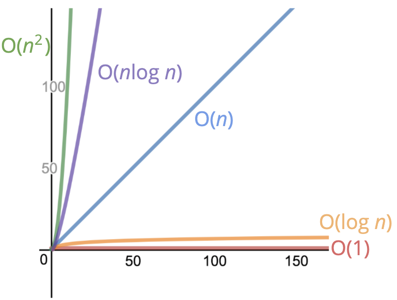

# 1일차
## 빅오 표기법(Big O Notation)
### 정의
* 정식으로 입력된 내용이 늘어날 수록 알고리즘에 실행시간이 어떻게 변하는지 설명하는 공식적인 방식
* 입력의 크기와 실행시간의 관계
* 대략적으로 숫자를 세는 것에 붙인 공식적인 표현

### 개념
* 여러가지 코드를 일반적으로 서로 비교하고 성능을 평가하는 방법 
즉, 코드를 분류하거나 비교 할 수 있는 시스템이라고 생각해도 됨

### 시간복잡도(빅오 표기법 단순화)

### 공간복잡도(빅오 표기법 단순화)
* boolean, 숫자, undefined, null은 자바스크립트에서 모두 불변 공간
* 문자열, reference 타입, 배열, 객체는 O(n) 공간

### 제약사항
* 측정되는 알고리즘의 시간과 공간 복잡도는 하드웨어에 영향을 받지 않음

# 2일차
## 배열과 오브젝트의 성능 평가